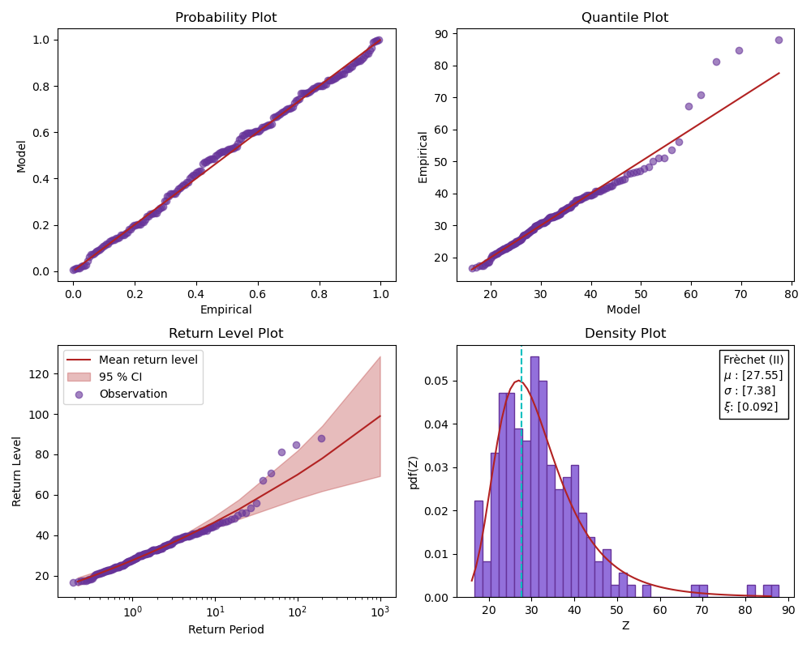

# hevapy

### The main functionality of the package is to :  

1. ##### Work with hydrological data
    - [X] GHCN data implemeted
    - [X] Do some preprocessing, to find record length, valid year, etc
2. ##### Do some extreme value analysis
    - [X] Stationary GEV estimation implemeted
    - [X] Non-stationary GEV estimation implemeted (Only changing mean)
    - [ ] Non-stationarit in variance and xi not implemented

3. ##### Generate good plots
    - [X] Plots for stationary GEV estimation 
    - [X] Plots for non-statinary GEV estimation (needs improvement)
    - [ ] World plots, still needs to be done

This is where the data can be downloaded
[GHCN](https://www1.ncdc.noaa.gov/pub/data/ghcn/daily/)

Some plots for fun.

### Some Todo's in terms of the figure 

