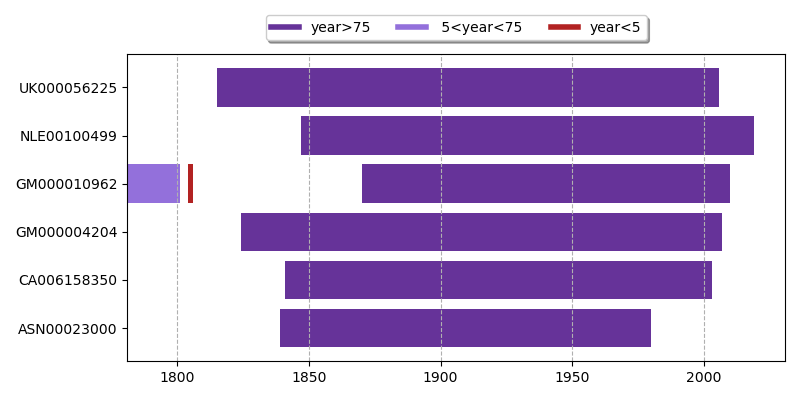
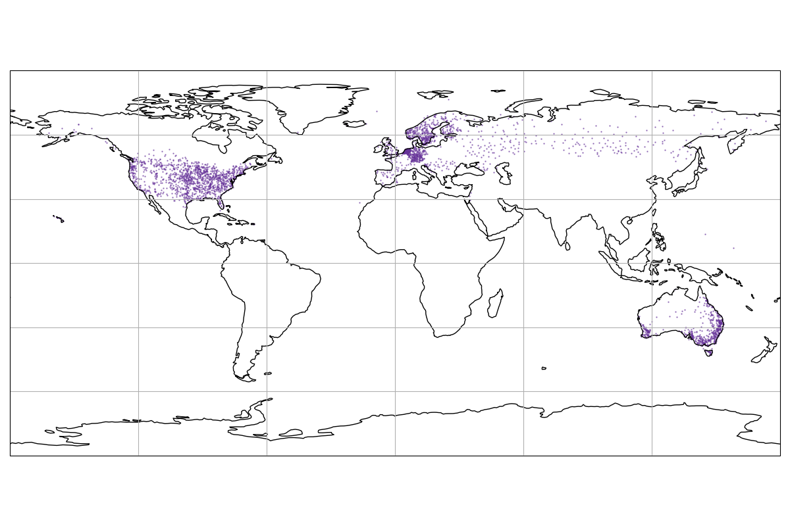
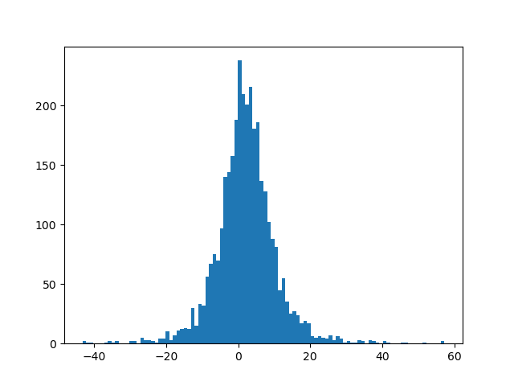

# hevapy

### The main functionality of the package is to :  

1. ##### Work with hydrological data
    - [X] GHCN data implemeted
    - [X] Do some preprocessing, to find record length, valid year, etc
2. ##### Do some extreme value analysis
    - [X] Stationary GEV estimation implemeted
    - [X] Non-stationary GEV estimation implemeted (Only changing mean)
    - [ ] Non-stationarit in variance and xi not implemented

3. ##### Generate good plots
    - [X] Plots for stationary GEV estimation 
    - [X] Plots for non-statinary GEV estimation (needs improvement)
    - [ ] World plots, still needs to be done

This is where the data can be downloaded
[GHCN](https://www1.ncdc.noaa.gov/pub/data/ghcn/daily/)

Some plots for fun.

### Some Planned Todo's in terms of the figure 

- [X]  Figure 1: Data completeness in every year
- [X]  Figure 2: Time-series plot, 20 year return level plot
- [X]  Figure 3: Composite world map, 50yr return level in start and end year
- [ ]  Figure 4: Composite world map, magnitude of event for 50 year return level event in start year, evaluate the the new return level (end year) of the same event, A map for change in years for return levels

##### Plot 1 : 
A map to show the length of the record for valid years. A valid year is one where there is data for 90% (329) or more number of days  in a year. 

##### Plot 2 : 
Creating a composite is not a good idea. It can be done manually later

The plot below shows 2 figure. 
- The first one shows the time series of the data.
- The red line shows how the 20 yr return level changes with time
- We assume that the mean changes linearly with time
- The other important thing to note is change in return level is independed of the frequency
- The change in 20 yr return level should be same as the change in 30, 40, 50, ..n year return level
- This is specific to the case where we assume that the mean is changing linearly with time. 
- This will not be same if sigma and xi are also changing with time
- The plot on the right shows how the GEV distribution changed over the time
- Precipitation is expressed in mm/day
- 

##### Plot 3 :
The figure below shows the location of stations for which further analysis is made
- The period chosen was from 1965-2015
- There are total 3300 stations with all the valid years between 1965-2015
- Valid years are the years where the data is available for more than 90% of the (>=329) days 

##### Plot 4 : 

This plot shows the how the 50 year return level changed from 1965-2015. 
- As mentioned earlier, this will be same as 20, 30, 40 or any n year return level change. (This is my understanding)
- The grids are 1x1 degrees
- If there are multiple stations in a grid (which happen many a times), the mean of change in return level is calculated
- The change in return level goest from -40 to +60 (roughly). The mean change in return level was about 2.5mm/day over the entire globe
- The scale is set from -10 to 10 for better visualisation

##### Additional Figure

This just gives an idea on how the change in (50 yr) return level is distributed
- Change in rl again is in mm/day

