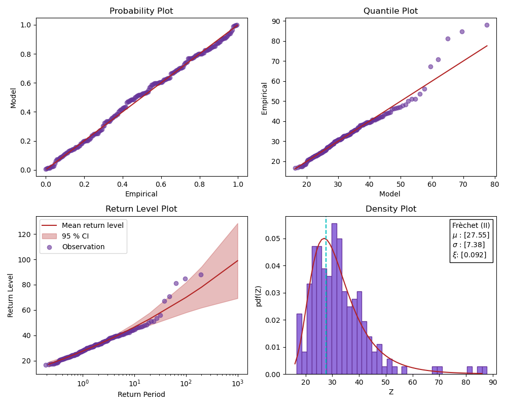
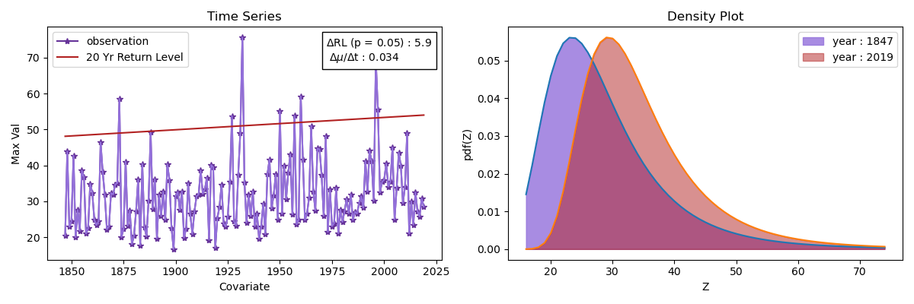
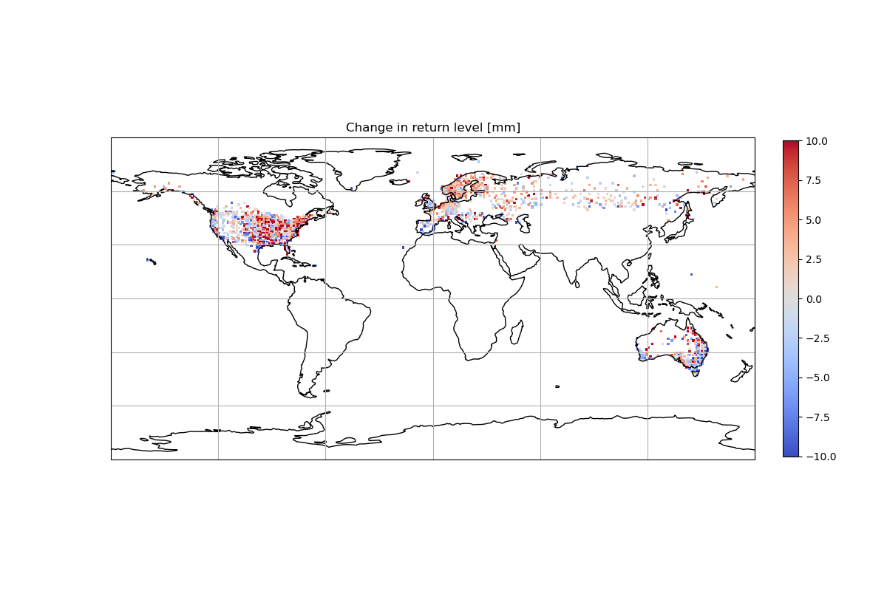

# HEVAPY  

The package is called Hydrological Extreme Value Analysis for Python and still is in development version. The first beta release is expected by September and will be called version 0.1.0

### What it brings?
- The package draws inspiration from ismev package in R and improve over the plots.

- The package implements non-stationary GEV analysis in python.

- The package also helps in downloading data from GHCN dataset, which inclues precipitation, temperature, etc.

### To Do
- Document the package
- Sharpen edges along the way

### Bonus Image

This is how the 50 year return level change looks across the globe for precipitation

